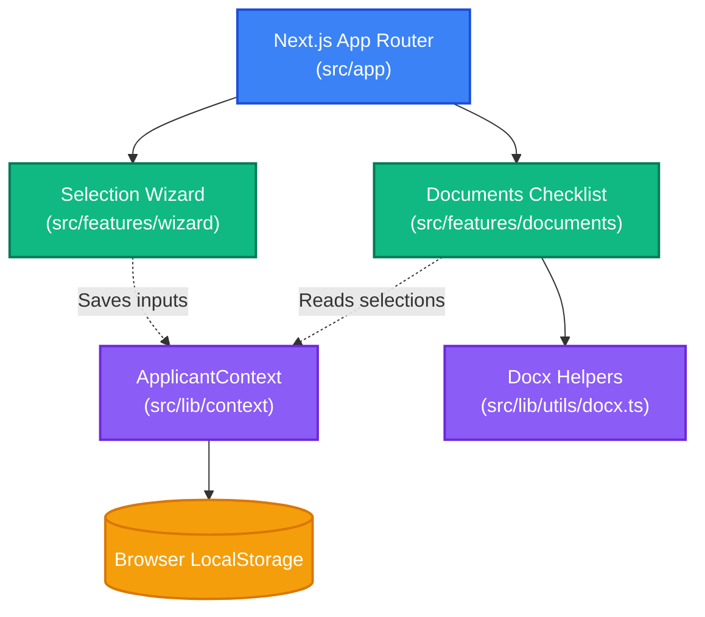

# VisaMate Frontend: Next.js Web Application — Developer Guide

This package contains the Next.js frontend web application for VisaMate. It acts as the selection wizard, interactive documents checklist, and asset compiler. Read this to understand routing conventions, layout boundaries, and monorepo workspace dependencies.

---

## 🔍 1. Architecture & Core Tech Stack

The frontend is a single-page web app inside Next.js, optimized for zero-server sandboxed operation.



### Core Technologies
* **Framework**: Next.js 15+ (App Router, React 19, TypeScript).
* **Styling**: Vanilla CSS variables mapping custom HSL themes.
* **State Management**: Client-side React Context (`ApplicantContext.tsx`) synced with browser storage.
* **Document Compilation**: Dynamic OpenXML generation (`docx`) and ZIP compiling (`jszip`) running entirely inside the client browser.

---

## 📂 2. Detailed Directory Layout & Routing Conventions

The project separates layout routes (`app/`) from core features (`features/`) and shared library files (`lib/`):

```
web/
├── tsconfig.json             ← TypeScript compile rules
├── next.config.ts            ← Next.js build parameters
├── package.json              ← Workspace dependencies & scripts
└── src/
    ├── app/                  ← Layout boundaries and routing pages
    │   ├── layout.tsx        ← Global layout (injects styling tokens & fonts)
    │   ├── page.tsx          ← Root redirect (routes / directly to /wizard)
    │   ├── wizard/           ← Selection Accordion page route
    │   └── documents/        ← Documents Checklist page route
    ├── components/           ← Shared UI controls (buttons, inputs)
    ├── data/                 ← Static visa requirements and attraction lists
    ├── features/             ← Feature-specific code
    │   ├── wizard/           ← Wizard card forms and SVG Flight Animation canvas
    │   └── documents/        ← Checklist UI, cover letter builder, and templates
    ├── lib/                  ← Core library helpers
    │   ├── context/          ← React context state and persistence rules
    │   ├── data/             ← Repository API layer
    │   └── utils/            ← Storage, validation, and date utils
    └── types/                ← Global TypeScript types & interface files
```

---

## ⚡ 3. Monorepo Integration & Local Lifecycle

> [!IMPORTANT]
> Because VisaMate is configured as an **npm workspaces monorepo**, always run installation, development, and building commands from the **monorepo root directory** (`/visamate`), rather than inside this subdirectory.

### Workspace CLI Controls (Run from Root)
* **Start Development Server**:
  ```bash
  npm run dev
  ```
  Launches the Next.js dev server on `http://localhost:3000`.
* **Compile and Build**:
  ```bash
  npm run build
  ```
  Runs the Next.js compiler and builds optimized production files.
* **Run ESLint Checks**:
  ```bash
  npm run lint
  ```
* **Install Shared Dependencies**:
  ```bash
  npm install
  ```
  This command installs packages across all workspaces and hoists dependencies to the root `node_modules`.

---

## 🛠️ 4. Future Modifications Guide

### Scenario A: Adding a Layout Navigation Header
To add a persistent global header across the Wizard and Documents screens:
1. Open the root layout file [layout.tsx](file:///d:/visamate/web/src/app/layout.tsx).
2. Create and insert your navigation HTML structure inside the body element:
   ```tsx
   export default function RootLayout({ children }: { children: React.ReactNode }) {
     return (
       <html lang="en">
         <body>
           <header style={{ height: 56, borderBottom: "1px solid rgba(255,255,255,0.08)" }}>
             <span>VisaMate Developer Portal</span>
           </header>
           <main>{children}</main>
         </body>
       </html>
     );
   }
   ```

### Scenario B: Installing Sub-workspace Dependencies
To install a library (such as `zod`) inside the frontend package from the monorepo root:
```bash
npm install zod -w web
```
This adds the package definition to `web/package.json` while hoisting the package download to the root `node_modules` directory.

---

## 🛠️ 5. Troubleshooting & Diagnostics

Run these diagnostic commands inside your command terminal to fix build cache errors:

### Cleaning Next.js Compiler Cache
If compilation states get out of sync, delete the cached Next.js folder:
```powershell
# Run from the /web workspace directory
Remove-Item -Path ".next" -Recurse -Force
```

### Resetting Monorepo Node Modules
If packages throw resolution errors or lockfile updates conflict:
```powershell
# Run from the monorepo root directory
Remove-Item -Path "node_modules", "web/node_modules" -Recurse -Force
npm install
```
