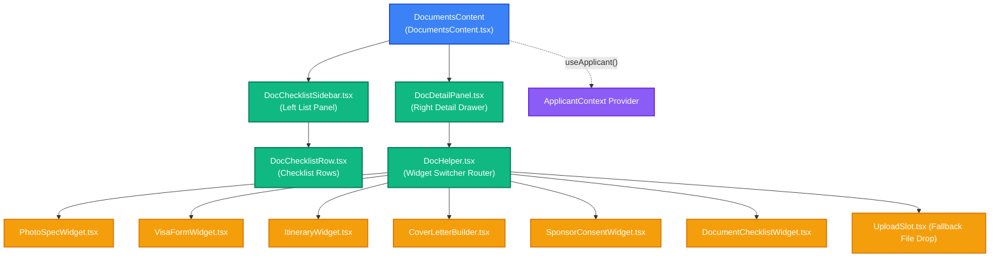

# 📂 VisaMate Documents Feature — Developer Guide & Widget Catalog

This guide provides an in-depth technical walkthrough of the **Documents** checklist, the split-panel master-detail UI, and the client-side document generation widgets in VisaMate. Read this to understand the React props, state shapes, custom hooks, and dynamic ZIP aggregation engine.

---

## 🔍 1. Subsystem Architecture & Split-Panel UI Flow

The Documents screen employs a high-fidelity, dual-panel master-detail layout designed to keep the user context intact while building visa assets.



### Component Breakdown
* **[DocumentsContent.tsx](file:///d:/visamate/web/src/features/documents/DocumentsContent.tsx)**: The orchestrator component. It queries the local repositories for visa requirements, holds the user's checklist state, computes progress percentages, and handles zip compilation.
* **[DocChecklistSidebar.tsx](file:///d:/visamate/web/src/features/documents/components/DocChecklistSidebar.tsx)**: Renders the categorized documents sidebar panel. Features progress bars per category group.
* **[DocChecklistRow.tsx](file:///d:/visamate/web/src/features/documents/components/DocChecklistRow.tsx)**: Displays individual checklist items with state indicators (`Required`, `Optional`, `Uploaded`, `Hardcopy`) and tooltips.
* **[DocDetailPanel.tsx](file:///d:/visamate/web/src/features/documents/components/DocDetailPanel.tsx)**: Renders the slide-out focused workspace. Triggers CSS shimmer animations when switching active documents.
* **[DocHelper.tsx](file:///d:/visamate/web/src/features/documents/components/DocHelper.tsx)**: Contextually resolves the `doc.specialWidget` key and mounts the correct builder or a standard file drag-and-drop slot.

---

## ⚙️ 2. Core API, State & Props

### Component Props: `DocumentsContentProps`
The controller accepts props to override the global context. This allows it to run embedded in check-in screens or stand alone.

```typescript
export interface DocumentsContentProps {
  embedded?: boolean;          // Suppresses outer navbar margins and footer branding
  country?: string;            // ISO 2-letter country code (e.g., "JP")
  countryName?: string;        // Friendly country name (e.g., "Japan")
  visaType?: string;           // Visa category identifier (e.g., "TOURIST")
  visaTypeName?: string;       // Friendly visa type description (e.g., "Tourist Visa")
  location?: string;           // Submission center code (e.g., "MUMBAI")
  locationName?: string;       // Submission center description
  sponsorship?: string;        // Sponsorship status ("SELF" | "SPONSORED")
  profile?: string;            // Profession profile ("employed" | "student" | "self-employed")
}
```

### React Component State Shape
Within [DocumentsContent.tsx](file:///d:/visamate/web/src/features/documents/DocumentsContent.tsx), state is structured as follows:

1. **`checked`** (`Record<string, boolean>`): Tracks completion checkmarks. Keys are unique document IDs.
   ```json
   {
     "JP_TOURIST_PASSPORT": true,
     "JP_TOURIST_ITINERARY": false
   }
   ```
2. **`uploads`** (`UploadsMap`): Maps document IDs to local JavaScript `File` objects created during inline generation or uploaded via the drop zone:
   ```typescript
   export type UploadsMap = Record<string, File>;
   ```
3. **`activeDocId`** (`string | null`): Keeps track of the selected document ID for the detail drawer.
4. **`downloadingZip`** (`boolean`): Triggers global loading overlays during ZIP packaging cycles.

### Derived State Math
Every state change triggers recalculation of derived progress:
* `totalDone`: `allDocs.filter(d => checked[d.id]).length`
* `requiredDone`: `requiredDocs.filter(d => checked[d.id]).length`
* `overallPct`: `(totalDone / allDocs.length) * 100`
* `uploadCount`: `Object.keys(uploads).length`

---

## 🎨 3. Specialized Widget Catalog

When a document requires specialized data assembly rather than a plain image/PDF upload, `DocHelper.tsx` mounts a custom builder widget:

| Widget Code | Component File | Description & Capabilities | Pre-fill Inputs Sourced |
| :--- | :--- | :--- | :--- |
| **`photo_spec`** | [PhotoSpecWidget.tsx](file:///d:/visamate/web/src/features/documents/PhotoSpecWidget.tsx) | Displays dimension canvas guides, age checks, and face percentages for passports. | `requirementsData.photoSpecifications` |
| **`visa_form`** | [VisaFormWidget.tsx](file:///d:/visamate/web/src/features/documents/visa_form/VisaFormWidget.tsx) | Step-by-step assistant for official paper forms. Provides copy buttons and field hints. | `repository.getFormFillFields()` |
| **`itinerary`** | [ItineraryWidget.tsx](file:///d:/visamate/web/src/features/documents/itinerary/ItineraryWidget.tsx) | Interactive day-by-day trip builder. Maps points of interest and exports Word files. | `ctx.travelStartDate`, `ctx.travelDuration` |
| **`cover_letter`** | [CoverLetterBuilder.tsx](file:///d:/visamate/web/src/features/documents/cover_letter/CoverLetterBuilder.tsx) | Seeder letter builder and interactive editor that exports `.docx` files. | `ctx.applicantName`, `ctx.passportNo` |
| **`sponsor_consent`**| [SponsorConsentWidget.tsx](file:///d:/visamate/web/src/features/documents/sponsor_consent/SponsorConsentWidget.tsx) | Generates a notarization-ready sponsorship declaration letter. | `ctx.sponsorName`, `ctx.sponsorPassport` |
| **`document_checklist`**| [DocumentChecklistWidget.tsx](file:///d:/visamate/web/src/features/documents/DocumentChecklistWidget.tsx) | Renders verification checklists and links directly to official embassy templates. | `requirementsData.checklistSpec` |

---

## 💾 4. Client-Side ZIP Aggregate Generator

The document exporter aggregates all uploaded and generated files client-side into a structured folder hierarchy without hitting a server.

```
[User Clicks "Download All"]
            │
            ▼
Extract files from 'uploads' state map
            │
            ▼
Group files into folder paths:
 - COMMON category ─────► "Common Documents/"
 - FINANCIALS category ──► "Financial Documents/"
 - SPONSORED category ───► "Sponsor Documents/"
            │
            ▼
Read File buffers ──► Write to JSZip tree
            │
            ▼
Trigger browser saveAs() (file-saver)
```

The aggregate logic is isolated in [downloadAllFiles.ts](file:///d:/visamate/web/src/features/documents/utils/downloadAllFiles.ts). It lazy-loads `jszip` and `file-saver` dynamically:

```typescript
import type { DocumentItem } from "@/types/document";

export async function downloadAllFiles(
  uploads: Record<string, File>,
  allDocs: DocumentItem[]
): Promise<void> {
  const JSZip = (await import("jszip")).default;
  const zip = new JSZip();

  for (const doc of allDocs) {
    const file = uploads[doc.id];
    if (!file) continue;

    // Resolve human-friendly folder names
    const folderName = doc.category.replace(/_/g, " ").toLowerCase();
    const formattedFolder = folderName.charAt(0).toUpperCase() + folderName.slice(1);
    
    const folder = zip.folder(formattedFolder);
    folder?.file(file.name, file);
  }

  const content = await zip.generateAsync({ type: "blob" });
  const { saveAs } = (await import("file-saver")).default;
  saveAs(content, "visamate_visa_application_package.zip");
}
```

---

## ⚙️ 5. Custom Hooks Deep Dive

### A. `useDocumentData`
Loads database JSON rules dynamically.
* **Path**: [useDocumentData.ts](file:///d:/visamate/web/src/features/documents/hooks/useDocumentData.ts)
* **Signature**:
  ```typescript
  export function useDocumentData(params: {
    country: string;
    visaType: string;
    location: string;
    sponsorship: string;
    countryName: string;
    visaTypeName: string;
    locationName: string;
  }): {
    data: DocumentData | null;
    itineraryData: ItineraryPlacesData | null;
    visaTypeData: VisaType | null;
    requirementsData: RequirementsData | null;
    loading: boolean;
    error: string | null;
  }
  ```

### B. `useDrawerAnimation`
Calculates GPU-accelerated transition properties to prevent lag during detail panel slide-ins.
* **Path**: [useDrawerAnimation.ts](file:///d:/visamate/web/src/features/documents/hooks/useDrawerAnimation.ts)
* **Signature**:
  ```typescript
  export function useDrawerAnimation(activeDocId: string | null): {
    visibleDocId: string | null;
    drawerOpacity: number;
    drawerTranslateY: number;
  }
  ```

### C. `useKeyboardNav`
Binds global keyboard shortcuts when the documents view is mounted.
* **Path**: [useKeyboardNav.ts](file:///d:/visamate/web/src/features/documents/hooks/useKeyboardNav.ts)
* **Signature**:
  ```typescript
  export function useKeyboardNav(params: {
    data: DocumentData | null;
    activeDocId: string | null;
    setActiveDocId: (id: string | null) => void;
  }): void
  ```
  * **Controls**: `ArrowUp`/`ArrowDown` navigates checklist, `Space` checks/unchecks rows, `Escape` closes details.

---

## 🛠️ 6. Future Modifications Guide

### Scenario A: Adding a New Dedicated Builder Widget
To wire in a custom builder (e.g. a `HotelVoucherBuilder`):
1. **Extend Types**: Open [document.ts](file:///d:/visamate/web/src/types/document.ts) and add the widget type to `SpecialWidget`:
   ```typescript
   export type SpecialWidget =
     | "photo_spec"
     | "visa_form"
     | "itinerary"
     | "cover_letter"
     | "document_checklist"
     | "sponsor_consent"
     | "hotel_voucher"; // Add here
   ```
2. **Add Requirement Mapper Code**: Open [mapRequirements.ts](file:///d:/visamate/web/src/features/documents/mapRequirements.ts) and register the mapping logic:
   ```typescript
   export const SPECIAL_WIDGETS: Record<string, SpecialWidget> = {
     // ...
     HOTEL_RESERVATION: "hotel_voucher",
   };
   ```
3. **Mount in Switcher**: Open [DocHelper.tsx](file:///d:/visamate/web/src/features/documents/components/DocHelper.tsx) and import your component:
   ```tsx
   {doc.specialWidget === "hotel_voucher" && (
     <HotelVoucherBuilder
       color={color}
       onFileReady={(file) => onUpload(file)}
     />
   )}
   ```

### Scenario B: Customizing Group Themes and Colors
Checklist categories are colored dynamically. To change group themes, modify `SECTION_META` in [mapRequirements.ts](file:///d:/visamate/web/src/features/documents/mapRequirements.ts):
```typescript
export const SECTION_META: Record<string, { icon: string; color: string }> = {
  COMMON: { icon: "passport", color: "#6366f1" },           // Indigo
  SELF_SPONSORED: { icon: "finance", color: "#10b981" },    // Emerald
  SPONSORED: { icon: "finance", color: "#0ea5e9" },         // Sky
};
```

---

## 🛠️ 7. Troubleshooting & Debugging

Open the browser's Developer Tools Console (`F12`) on the documents page to run these diagnostic routines:

### Inspecting Local Hook State (React Fiber query)
Because state hook variables are kept inside closures, run this snippet in the browser console to extract the active checklist state directly from the DOM tree:
```javascript
(function inspectChecklistState() {
  const element = document.querySelector(".vm-two-panel");
  if (!element) return console.error("Documents checklist DOM node not found.");
  
  const reactKey = Object.keys(element).find(k => k.startsWith("__reactFiber$") || k.startsWith("__reactContainer$"));
  if (!reactKey) return console.error("React Fiber node key not found.");
  
  let node = element[reactKey];
  while (node && !node.memoizedState) { node = node.return; }
  
  if (node && node.memoizedState) {
    let hooksState = [];
    let currentHook = node.memoizedState;
    while (currentHook) {
      hooksState.push(currentHook.memoizedState);
      currentHook = currentHook.next;
    }
    console.log("=== Active Checklist States ===");
    console.log("Checked items map:", hooksState[0]);
    console.log("Uploaded files map:", hooksState[1]);
    console.log("Active selected doc ID:", hooksState[3]);
  } else {
    console.warn("Could not traverse Fiber state hooks.");
  }
})();
```

### Programmatic Checklist Override
To mock/simulate a fully completed checklist for testing final layouts and PDF builders:
```javascript
(function checkAllRows() {
  const checkboxes = document.querySelectorAll(".vm-checklist-checkbox");
  if (!checkboxes.length) return console.log("No checklist checkboxes found in DOM.");
  checkboxes.forEach(cb => {
    if (!cb.checked) {
      cb.click(); // Triggers react onClick handlers safely
    }
  });
  console.log(`Successfully checked ${checkboxes.length} rows.`);
})();
```

---

## 🔒 8. Security & Data Privacy Sandboxing

* **Sandbox Boundary**: All uploaded/generated files reside exclusively in React state as transient binary streams. Files are never stored on the server.
* **Eviction Cycle**: Triggering `reset()` or clicking "Start Fresh" removes all file object references from memory and clears local storage keys immediately.
