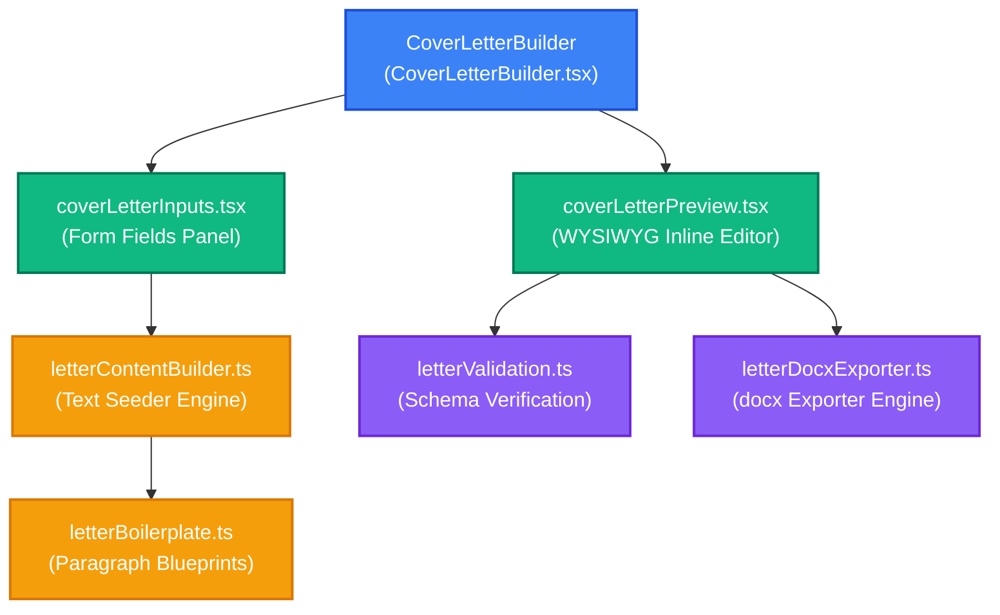

# ✉️ VisaMate Cover Letter Builder — Developer Guide & Exporter Engine

This guide walks through the architecture, seeder heuristics, editor states, and DOCX generation pipeline of the **Cover Letter Builder** in VisaMate. Read this to understand how wizard inputs are transformed into formatted paragraphs and exported to Word documents.

---

## 🔍 1. Architecture & Component Flow

The Cover Letter builder splits assembly into two distinct steps: Step 1 (Interactive Input Gathering) and Step 2 (Editable WYSIWYG letter preview).



### Component Breakdown
* **[CoverLetterBuilder.tsx](file:///d:/visamate/web/src/features/documents/cover_letter/CoverLetterBuilder.tsx)**: Manages step state (`activeStep = 1 | 2`), form values, and paragraphs state.
* **[coverLetterInputs.tsx](file:///d:/visamate/web/src/features/documents/cover_letter/components/coverLetterInputs.tsx)**: Displays profile-specific inputs (employment certificates, sponsor data).
* **[coverLetterPreview.tsx](file:///d:/visamate/web/src/features/documents/cover_letter/components/coverLetterPreview.tsx)**: Displays the WYSIWYG editor. Renders blocks inside auto-expanding textareas.
* **[letterContentBuilder.ts](file:///d:/visamate/web/src/features/documents/cover_letter/utils/letterContentBuilder.ts)**: Evaluates user parameters and resolves paragraph contents from the blueprints.
* **[letterDocxExporter.ts](file:///d:/visamate/web/src/features/documents/cover_letter/utils/letterDocxExporter.ts)**: Interacts with the `docx` library. Cleans raw strings and writes them as open XML nodes.

---

## ⚙️ 2. Input Schemas, Validation & Seed Mapping

When the builder mounts, Step 1 forms are pre-filled by pulling attributes from the global `ApplicantContext`.

### Form Inputs Interface: `CoverLetterInputs`
Tracks inputs inside [CoverLetterBuilder.tsx](file:///d:/visamate/web/src/features/documents/cover_letter/CoverLetterBuilder.tsx):

```typescript
export interface CoverLetterInputs {
  applicantProfile: "employed" | "student" | "self-employed" | null;
  companyName?: string;
  designation?: string;
  institutionName?: string;
  sponsorshipType: "self" | "sponsored" | null;
  bankBalance?: string;
  departureCity?: string;
  countriesVisited: Array<{ country: string; month: string }>;
  travellingWith: "alone" | "with";
  companion?: "mother" | "father" | "spouse" | "friend" | "";
  hasDependant: "yes" | "no";
  sponsorName?: string;
  sponsorRel?: string;
  sponsorPassport?: string;
  sponsorDob?: string;
  sponsorMobile?: string;
  sponsorCity?: string;
  sponsorAccompanying?: "accompanying" | "staying" | null;
  sponsorshipReason?: string;
}
```

### Seeding Heuristics (`seedLetterState`)
The seeder transforms form inputs into paragraph blocks based on the following patterns:
1. **Visa Details**: Resolves trip metrics:
   * departure city -> arrival city.
   * duration -> number of days.
2. **Immigration History Formatting**: Evaluates `countriesVisited`:
   * *If visits exist*: `"In the past five years, I have successfully traveled to and returned from: UK (October 2024), Japan (June 2023)..."`
   * *If empty*: `"I have maintained a clean immigration record and have not traveled internationally in the last five years."`
3. **Economic Ties Builder**: Builds confidence in return motivations:
   * *Employed*: `"I am currently employed at [Tech Corp] as [Software Engineer], drawing an annual income. I have a sanctioned leave of absence..."`
   * *Student*: `"I am currently enrolled at [National University]... I must return to resume classes on [Date]..."`

---

## 🎨 3. WYSIWYG Editor State & Hints Safeguards

### Editable Paragraph Blocks
Paragraphs are saved in component state as key-value pairs matching sections of the letter:

```typescript
export interface CoverLetterParagraphs {
  lIntro: string;       // Date, Address, Subject
  lSalutation: string;  // "Dear Sir/Madam,"
  lPurpose: string;     // Purpose & travel details
  lFinance: string;     // Salary & sponsorship text
  lItinerary: string;   // Outline of stay cities
  lImmigration: string; // Previous travel history
  lTies: string;        // Local economic ties
  lConclusion: string;  // Contact info & request
  lDocRows: string;     // Attachments checklist text
}
```

### Hint Blocks (`[[HINT: ...]]`)
To guide users through adding manual details:
* The seeder embeds text cues like `[[HINT: Specify your home town family ties here]]` into editable states.
* The preview highlight matches these codes and wraps them in amber warning blocks in the UI.
* **Safety Exporter Regex**: If a user leaves hints inside the textareas, [letterDocxExporter.ts](file:///d:/visamate/web/src/features/documents/cover_letter/utils/letterDocxExporter.ts) runs a clean-up pattern before writing the Word file:
  ```typescript
  export function stripHints(text: string): string {
    return text.replace(/\[\[HINT:.*?\]\]/gi, "").trim();
  }
  ```

---

## 💾 4. Word Document DOCX Exporter Engine

The DOCX builder outputs formatted OpenXML files directly in the browser.

```
[User Clicks "Export DOCX"]
            │
            ▼
Strip [[HINT: ...]] strings from all paragraphs
            │
            ▼
Build docx Document:
- Page Margins: 1440 twips (1 inch)
- Page Font: Arial (11pt / 22pt line spacing)
            │
            ▼
Append Header details (Date, Embassy address, Subject line)
            │
            ▼
Map paragraph arrays into docx.Paragraph nodes
            │
            ▼
Convert bullet lines (lDocRows) into docx.BulletList nodes
            │
            ▼
Generate binary ArrayBuffer ──► Trigger FileSaver prompt
```

### Layout Specs (Twips Metrics)
Word layouts are defined in **Twips** (one-twentieth of a point). Key metrics configured in [letterDocxExporter.ts](file:///d:/visamate/web/src/features/documents/cover_letter/utils/letterDocxExporter.ts):
* **Margins**: `1440` twips (1.0 inch) on all sides.
* **Line Spacing**: `240` twips (1.0 lines) or `360` twips (1.5 lines).
* **Space After Paragraphs**: `120` twips (6pt) to ensure clean readability without double-spacing.

---

## 🛠️ 5. Future Modifications Guide

### Scenario A: Adding a New Input Field (e.g. "Tax Identification Number")
To capture and embed a tax ID into the letter layout:
1. **Update Forms Interface**: Add the key to the inputs interface inside [letterValidation.ts](file:///d:/visamate/web/src/features/documents/cover_letter/utils/letterValidation.ts):
   ```typescript
   export interface CoverLetterInputs {
     // ...
     taxId?: string;
   }
   ```
2. **Bind Input Fields**: Add the input field component to [coverLetterInputs.tsx](file:///d:/visamate/web/src/features/documents/cover_letter/components/coverLetterInputs.tsx):
   ```tsx
   <InputField
     label="Tax Identification Number (PAN)"
     value={inputs.taxId || ""}
     onChange={(val) => onChange({ taxId: val })}
   />
   ```
3. **Inject in Seeder**: Open [letterContentBuilder.ts](file:///d:/visamate/web/src/features/documents/cover_letter/utils/letterContentBuilder.ts) and add the field into the financial paragraph construction:
   ```typescript
   // Inside seedLetterState
   return {
     // ...
     lFinance: `My financial details are verified. My Tax Identification Number is ${inputs.taxId || "[PAN Number]"}. ` + buildFinanceBlock(inputs),
   };
   ```

### Scenario B: Customizing Document Typography and Spacings
To change default fonts or styles, update the constructor in [letterDocxExporter.ts](file:///d:/visamate/web/src/features/documents/cover_letter/utils/letterDocxExporter.ts):
```typescript
const doc = new Document({
  styles: {
    default: {
      document: {
        run: {
          font: "Calibri", // Change default font family
          size: 22,        // 11pt font size (22 half-points)
          color: "2D3748", // Dark slate color
        },
      },
    },
  },
  sections: [
    {
      properties: {
        page: {
          margin: { top: 1440, bottom: 1440, left: 1440, right: 1440 },
        },
      },
      children: [
        // Paragraph components go here
      ],
    },
  ],
});
```

---

## 🛠️ 6. Troubleshooting & Debugging

Open the browser's Developer Tools Console (`F12`) on the Cover Letter route to run these diagnostic tools:

### Printing the Seeder Outputs
To inspect what text blocks were created by the seeding builder based on active wizard details:
```javascript
(function dumpCoverLetterState() {
  const previewContainer = document.querySelector(".vm-cover-letter-panel");
  if (!previewContainer) return console.log("Cover Letter Builder panel not found.");
  
  // Query all paragraph inputs in the preview panel
  const textareas = previewContainer.querySelectorAll(".vm-inline-textarea");
  console.log(`Found ${textareas.length} editable paragraphs in editor:`);
  
  textareas.forEach((area, i) => {
    console.log(`--- [Paragraph ${i + 1}] ---`);
    console.log(area.value.trim());
  });
})();
```

### Running Validation Schemas Manually
To check validation outputs against mock data profiles:
```javascript
(async function runValidationTests() {
  const validator = await import("/web/src/features/documents/cover_letter/utils/letterValidation.ts");
  
  // Emulate an employed applicant without designation
  const mockInputs = {
    applicantProfile: "employed",
    companyName: "Google",
    designation: "", // Triggers validation error
    sponsorshipType: "self",
    travellingWith: "alone",
    hasDependant: "no",
    countriesVisited: []
  };
  
  const results = validator.validateCoverLetterInputs(mockInputs);
  console.log("Validation Results:", results.valid ? "PASSED" : "FAILED");
  console.table(results.errors);
})();
```

### Inspecting Under-the-Hood XML Structures
To inspect what ZIP archive nodes are created by `docx` before download:
```javascript
(async function testDocxBuffer() {
  console.log("Testing DOCX generator buffer conversion...");
  const mockParagraphs = {
    lIntro: "Date: 22 May 2026\nTo the Embassy of Japan",
    lSalutation: "Dear Sir/Madam,",
    lPurpose: "I am writing to request a tourist visa.",
    lDocRows: "1. Passport\n2. Itinerary"
  };
  
  const exporter = await import("/web/src/features/documents/cover_letter/utils/letterDocxExporter.ts");
  const blob = await exporter.generateLetterDocx(mockParagraphs);
  console.log(`Successfully generated DOCX Blob! Size: ${blob.size} bytes. Type: ${blob.type}`);
})();
```