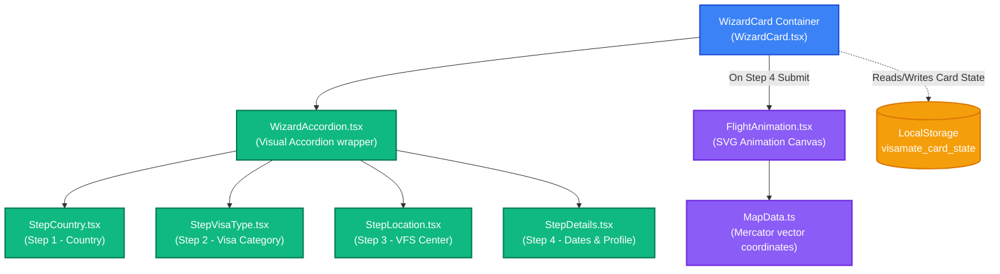

# ✈️ VisaMate Selection Wizard & Flight Animation — Developer Guide

This guide walks through the architecture, state synchronization, Mercator projections, Bezier curve geometry, and easing mechanics of the **VisaMate Selection Wizard** and **SVG Flight Animation Canvas**.

---

## 🔍 1. Architecture & Component Workflow

The Selection Wizard captures applicant intent and triggers a high-performance SVG flight path animation before unlocking visa-specific checklist resources.



### Component Breakdown
* **[WizardCard.tsx](file:///d:/visamate/web/src/features/wizard/WizardCard.tsx)**: Top-level controller. Coordinates steps (`activeStep`), flight state, and session resume prompts.
* **[WizardAccordion.tsx](file:///d:/visamate/web/src/features/wizard/WizardAccordion.tsx)**: Manages transitions and scrolls active inputs to the center of the viewport.
* **[FlightAnimation.tsx](file:///d:/visamate/web/src/features/wizard/FlightAnimation.tsx)**: High-performance SVG canvas. Tracks the plane coordinate offsets, applies Bezier transitions, and runs particle emission paths.
* **[MapData.ts](file:///d:/visamate/web/src/features/wizard/MapData.ts)**: Contains raw SVG coordinates for the background world landmasses and centered hub coordinates.

---

## 📐 2. SVG Mercator Coordinate Projections

Rather than placing city indicators arbitrarily, VisaMate maps coordinates onto a standard Mercator projection canvas bounding box.

### Viewport Constants
```typescript
const MAP_MIN_X = 30.767;     // Westernmost edge boundary
const MAP_MIN_Y = 241.591;    // Northernmost edge boundary
const MAP_WIDTH = 784.077;    // Viewport width
const MAP_HEIGHT = 458.627;   // Viewport height
```

### Origin Coordinates (VFS Hubs)
Locations are mapped using pre-calculated X/Y pixel coordinate values matching the vector map landmass:
* `DELHI`: `{ x: 594.3, y: 454.8 }`
* `MUMBAI`: `{ x: 584.8, y: 480.3 }`
* `BENGALURU`: `{ x: 595.2, y: 496.6 }`
* `CHENNAI`: `{ x: 601.1, y: 496.3 }`
* `KOLKATA`: `{ x: 618.9, y: 470.9 }`
* `HYDERABAD`: `{ x: 597.1, y: 484.8 }`

### Destination Coordinates (Country Capitals)
* `JP` (Japan - Tokyo): `{ x: 725.0, y: 418.0 }`
* `KR` (South Korea - Seoul): `{ x: 698.0, y: 413.0 }`
* `US` (United States - Washington D.C.): `{ x: 236.0, y: 395.0 }`
* `AU` (Australia - Canberra): `{ x: 795.0, y: 705.0 }`
* `GB` (United Kingdom - London): `{ x: 413.0, y: 404.0 }`
* `SG` (Singapore): `{ x: 650.0, y: 520.0 }`

---

## ⚡ 3. Mathematical Calculations & Path Easing

The flight route is calculated dynamically using a quadratic Bezier curve to emulate flight paths on a spherical globe.

### Great-Circle Control Points (`getArcControlPoint`)
To ensure paths bow upward (Northward on a Mercator map), control points are adjusted dynamically:
```typescript
function getArcControlPoint(
  x1: number, y1: number,
  x2: number, y2: number
): { cx: number; cy: number } {
  const mx = (x1 + x2) / 2;
  const my = (y1 + y2) / 2;
  const dx = x2 - x1;
  const dy = y2 - y1;
  const dist = Math.sqrt(dx * dx + dy * dy);

  const perpX = -dy / dist;
  const perpY = dx / dist;

  // Arc height is proportional to the distance, capped at 160px
  const arcHeight = Math.min(dist * 0.28, 160);
  const bow = perpY > 0 ? -arcHeight : arcHeight;

  return {
    cx: mx + perpX * Math.abs(bow) * 0.1,
    cy: my + bow, // Negative values shift the curve upwards in SVG space
  };
}
```

### Quadratic Bezier Interpolation (`pointOnQuadratic`)
Locates the exact plane coordinates and calculates rotation angles:
```typescript
function pointOnQuadratic(
  x1: number, y1: number,
  cx: number, cy: number,
  x2: number, y2: number,
  t: number
): { x: number; y: number; angle: number } {
  const mt = 1 - t;
  const x = mt * mt * x1 + 2 * mt * t * cx + t * t * x2;
  const y = mt * mt * y1 + 2 * mt * t * cy + t * t * y2;
  
  // Tangent vectors for rotation angle
  const tx = 2 * (mt * (cx - x1) + t * (x2 - cx));
  const ty = 2 * (mt * (cy - y1) + t * (y2 - cy));
  
  return { x, y, angle: Math.atan2(ty, tx) * (180 / Math.PI) };
}
```

### Takeoff & Landing Easing (`easeInOutCubic`)
Applies custom easing to simulate takeoff acceleration and landing deceleration:
```typescript
function easeInOutCubic(t: number): number {
  return t < 0.5 ? 4 * t * t * t : 1 - Math.pow(-2 * t + 2, 3) / 2;
}
```

### Camera Tracking & Lerping
To center the active path on small screen layouts:
```typescript
// Pans viewport center slightly towards plane position (nudge strength: 6%)
const nudgeX = (plane.x - centerX) * 0.06;
const nudgeY = (plane.y - centerY) * 0.06;
```

---

## 🗄️ 4. Local Card State Schema: `visamate_card_state`

Wizard states are saved inside localStorage under the key `visamate_card_state`.

```json
{
  "activeStep": 3,
  "flightState": "animating",
  "pendingSelections": {
    "country": "JP",
    "countryName": "Japan",
    "visaType": "TOURIST",
    "visaTypeName": "Tourist Visa",
    "location": "MUMBAI",
    "locationName": "Mumbai",
    "sponsorship": "SELF",
    "profile": "EMPLOYED"
  }
}
```
* **`flightState`** (`"idle" | "animating" | "landed"`):
  * `"idle"`: Interactive wizard selection accordion is open.
  * `"animating"`: Flight animation canvas covers card space.
  * `"landed"`: Flight animation finished, client redirects to documents lists.

---

## 🛠️ 5. Future Modifications Guide

### Scenario A: Adding a Step to the Wizard
To add a "Step 5: Travel History" section:
1. **Update Total Steps**: Open [WizardCard.tsx](file:///d:/visamate/web/src/features/wizard/WizardCard.tsx) and update bounds checks:
   ```typescript
   const TOTAL_STEPS = 5;
   ```
2. **Develop Step Form**: Create `StepTravelHistory.tsx` in [steps/](file:///d:/visamate/web/src/features/wizard/steps).
3. **Register in Accordion**: Open [WizardLeftPanel.tsx](file:///d:/visamate/web/src/features/wizard/WizardLeftPanel.tsx) and mount the collapsible step:
   ```tsx
   <WizardAccordion
     title="Travel History"
     stepIndex={4}
     activeStep={activeStep}
   >
     <StepTravelHistory />
   </WizardAccordion>
   ```

### Scenario B: Adding a New Destination Country Code Hub
To map a flight to France (FR - Paris):
1. Locate `DESTINATION_CENTERS` inside [FlightAnimation.tsx](file:///d:/visamate/web/src/features/wizard/FlightAnimation.tsx).
2. Add the approximate Mercator coordinates:
   ```typescript
   const DESTINATION_CENTERS: Record<string, { x: number; y: number }> = {
     // ...
     FR: { x: 422.0, y: 418.0 },
   };
   ```

---

## 🛠️ 6. Troubleshooting & Debugging

Open the browser's Developer Tools Console (`F12`) on the wizard page to run these diagnostic tools:

### Simulating a Pre-selected Flight State
To bypass wizard forms and force-start the flight animation to Tokyo:
```javascript
(function forceFlightSimulation() {
  const cardState = {
    activeStep: 3,
    flightState: "animating",
    pendingSelections: {
      country: "JP",
      countryName: "Japan",
      visaType: "TOURIST",
      visaTypeName: "Tourist Visa",
      location: "DELHI",
      locationName: "New Delhi",
      sponsorship: "SELF",
      profile: "EMPLOYED"
    }
  };
  
  const applicantData = {
    country: "JP",
    countryName: "Japan",
    visaType: "TOURIST",
    visaTypeName: "Tourist Visa",
    vfsCenter: "DELHI",
    sponsorshipType: "self",
    applicantProfile: "employed"
  };
  
  localStorage.setItem('visamate_card_state', JSON.stringify(cardState));
  localStorage.setItem('visamate_applicant_data', JSON.stringify(applicantData));
  console.log("Mock session injected. Refreshing page...");
  location.reload();
})();
```

### Inspecting Active Accordion Memoized States
Run this React Fiber inspector to read the current state of `WizardCard` directly:
```javascript
(function inspectWizardCardState() {
  const cardElement = document.querySelector(".wizard-card");
  if (!cardElement) return console.error("Wizard card DOM node not found.");
  
  const reactKey = Object.keys(cardElement).find(k => k.startsWith("__reactFiber$") || k.startsWith("__reactContainer$"));
  if (!reactKey) return console.error("React Fiber node key not found.");
  
  let node = cardElement[reactKey];
  while (node && !node.memoizedState) { node = node.return; }
  
  if (node && node.memoizedState) {
    let hooksState = [];
    let currentHook = node.memoizedState;
    while (currentHook) {
      hooksState.push(currentHook.memoizedState);
      currentHook = currentHook.next;
    }
    console.log("=== Active Wizard Card States ===");
    console.log("Active step index:", hooksState[1]);
    console.log("Flight animation state:", hooksState[4]);
    console.log("Pending selections map:", hooksState[5]);
  } else {
    console.warn("Could not traverse Fiber state hooks.");
  }
})();
```
