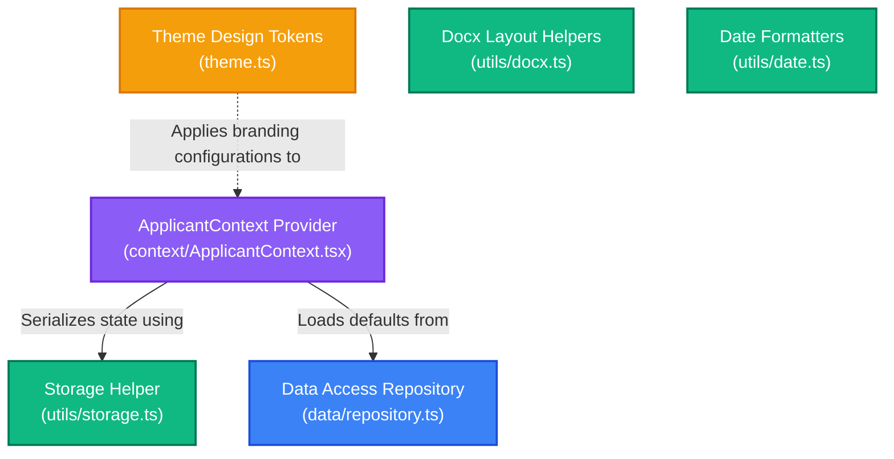

# 🛠️ VisaMate Core Library & Utilities — Developer Guide

This guide walks through the shared libraries, data access patterns, SSR-safe localStorage utilities, dynamic DOCX layout helpers, date formatting algorithms, and design tokens configuration in VisaMate.

---

## 🔍 1. Subsystem Architecture

The library directory houses the functional foundation of the application, decoupling UI rendering from static database resolutions, design definitions, and local caching.



---

## ⚛️ 2. State Management (Applicant Context)

Applicant data (such as names, dates, and passport numbers) is kept in a global, reactive, single source of truth called the **Applicant Context**.
* **Guide**: For comprehensive documentation on hook consumption, data synchronization, SSR hydration safeguards, and data structures, see the [Applicant Context Developer Guide](file:///d:/visamate/web/src/lib/context/README.md).

---

## 🗄️ 3. Data Repository API Layer

The data layer [repository.ts](file:///d:/visamate/web/src/lib/data/repository.ts) encapsulates JSON files. Every function is marked `async`, meaning the application can migrate to a database server (e.g. Prisma or raw SQL) with zero adjustments to the UI.

### Core API Specifications
All database queries must route through these functions:

```typescript
// 1. Returns display meta for all configured destination countries
export async function getAllCountries(): Promise<CountryCatalogEntry[]>

// 2. Returns structured configuration info for a single country
export async function getCountryInfo(countryCode: string): Promise<CountryInfo | null>

// 3. Returns the list of supported visa categories for a country
export async function getVisaTypes(countryCode: string): Promise<VisaType[]>

// 4. Returns VFS submission center locations matching a country's configuration
export async function getLocationsForCountry(countryCode: string): Promise<LocationCatalogEntry[]>

// 5. Returns address, timing details, and coordinates for a VFS submission center
export async function getVfsCenterInfo(locationCode: string): Promise<VfsCenterInfo | null>

// 6. Returns document checklist groups, requirements, and photo guides
export async function getRequirementsData(
  countryCode: string,
  visaTypeCode: string,
  locationCode: string
): Promise<RequirementsData | null>

// 7. Returns day-by-day sightseeing attractions data
export async function getItineraryPlaces(countryCode: string): Promise<ItineraryPlacesData | null>

// 8. Returns flat fields and hints for the step-by-step form helper
export async function getFormFillFields(dataKey: string | null | undefined): Promise<FormFillField[]>
```

---

## 🎨 4. Theme Configuration & Styling Tokens

Styling values are configured in [theme.ts](file:///d:/visamate/web/src/lib/theme.ts). This object contains HSL color values and layout configurations, ensuring design consistency across components:

```typescript
export const T = {
  // Theme HSL Colors
  indigo: "#6366f1",
  emerald: "#10b981",
  amber: "#fbbf24",
  rose: "#f43f5e",
  
  // Theme Backgrounds
  surface: "#090d16",
  surface2: "#0f172a",
  border: "rgba(255,255,255,0.08)",
  muted: "rgba(255,255,255,0.45)",
  
  // Breakpoints
  mobileMax: "767px",
} as const;
```

---

## 🔧 5. Shared Utilities Inventory

### A. SSR-Safe Local Storage Wrapper (`storage.ts`)
In Next.js, components are pre-compiled on the server. Accessing the global `window` object directly triggers server crash errors (`window is not defined`). The helper [storage.ts](file:///d:/visamate/web/src/lib/utils/storage.ts) wraps all calls to safely skip server evaluation:

```typescript
export const storage = {
  get<T>(key: string, fallback: T): T {
    if (typeof window === "undefined") return fallback;
    try {
      const item = localStorage.getItem(key);
      return item ? JSON.parse(item) : fallback;
    } catch (e) {
      console.error(e);
      return fallback;
    }
  },
  set<T>(key: string, value: T): void {
    if (typeof window === "undefined") return;
    try {
      localStorage.setItem(key, JSON.stringify(value));
    } catch (e) {
      console.error(e);
    }
  }
};
```

### B. Dynamic Word Exporter Helpers (`docx.ts`)
Houses the layout templates (default fonts, line spacing, table padding, border widths) used by the Cover Letter, Travel Itinerary, and Sponsor Consent letter generators:
* Standardizes Arial 11pt formatting.
* Applies formal margins (1 inch / 1440 twips).
* Generates bullet spacing helpers.

### C. Date Formatters (`date.ts`)
Converts string inputs (e.g. `"2026-05-22"`) into formal date structures:
```typescript
// Converts ISO date strings to human-readable format
export function fmtDate(isoString: string): string
// Example: fmtDate("2026-05-22") -> "22 May 2026"

// Calculates ending date based on duration days
export function fmtDateEnd(startDate: string, durationDays: number): string
// Example: fmtDateEnd("2026-05-22", 15) -> "5 June 2026"

// Converts month selector values to human-friendly headings
export function fmtMonthYear(monthString: string): string
// Example: fmtMonthYear("2026-05") -> "May 2026"
```

---

## 🛠️ 6. Future Modifications Guide

### Scenario A: Adding a New Country to the Repository
To add a new country (e.g. Germany - DE):
1. **Add Catalog Entry**: Open [repository.ts](file:///d:/visamate/web/src/lib/data/repository.ts) and add the entry to `COUNTRY_CATALOG`:
   ```typescript
   {
     code: "DE",
     name: "Germany",
     photo: "https://images.unsplash.com/photo-...",
     supported: true,
   }
   ```
2. **Create Configuration Files**: Create folders and JSON templates:
   * Create `web/src/data/countries/germany/info.json`
   * Create `web/src/data/countries/germany/visa-types.json`
3. **Import Dynamically**: Update `getCountryInfo` in `repository.ts` to map DE:
   ```typescript
   if (cc === "DE") {
     return (await import("../../data/countries/germany/info.json")).default as CountryInfo;
   }
   ```

### Scenario B: Customizing Global CSS Border Radius
To change spacing scales across the application:
1. Open [theme.ts](file:///d:/visamate/web/src/lib/theme.ts).
2. Register the radius token:
   ```typescript
   export const T = {
     // ...
     radiusLarge: "20px",
     radiusMedium: "12px",
   } as const;
   ```
3. Use the value inside custom element styles:
   ```tsx
   <div style={{ borderRadius: T.radiusMedium, background: T.surface2 }} />
   ```

---

## 🛠️ 7. Troubleshooting & Debugging

Open the browser's Developer Tools Console (`F12`) to run these diagnostic checks:

### Testing Date Calculation Boundaries
To verify if date math functions handle timezone shifts or month crossovers correctly:
```javascript
(async function testDateUtilities() {
  const dateUtils = await import("/web/src/lib/utils/date.ts");
  
  // Leap year crossover check
  const start = "2028-02-20"; // 2028 is a leap year
  const end = dateUtils.fmtDateEnd(start, 15);
  console.log(`Leap Year Cross Check: Start(${start}) + 15 Days -> End(${end})`);
  // Expected output: "5 March 2028"
  
  // Year crossover check
  const startDec = "2026-12-25";
  const endJan = dateUtils.fmtDateEnd(startDec, 10);
  console.log(`Year Cross Check: Start(${startDec}) + 10 Days -> End(${endJan})`);
  // Expected output: "3 January 2027"
})();
```

### Programmatic localStorage Overwrite
To verify SSR hydration safety and check how the UI renders when data is loaded from browser storage:
```javascript
(function forceMockStorage() {
  const key = "visamate_applicant_data";
  const mockData = {
    applicantName: "Jane Doe",
    passportNo: "Z9876543",
    country: "JP",
    countryName: "Japan",
    travelStartDate: "2026-12-01",
    travelDuration: 10
  };
  
  localStorage.setItem(key, JSON.stringify(mockData));
  console.log("Mock data written to local storage. Refreshing page...");
  location.reload();
})();
```
