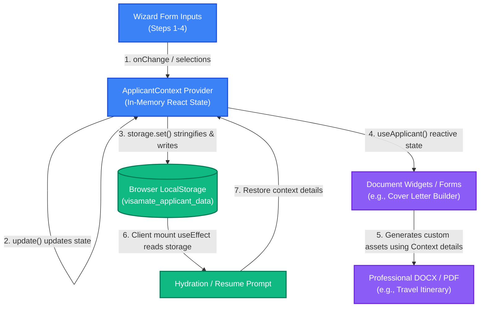

# VisaMate State Management: Applicant Context & Session Persistence — Developer Guide

This document is a comprehensive guide to **Applicant Context** (the in-memory global state) and **Session Persistence** (the safe local storage engine) in VisaMate. Read this to understand how user information is captured, shared, stored, hydrated, and modified across different components.

---

## 🔍 1. Overview & Architecture

VisaMate employs a decoupled, split-state architecture. It separates dynamic UI navigation state from the core applicant data model. 



* **Applicant Context**: Represents the reactive in-memory single source of truth for the entire application. It allows components in different routes or widget drawers to instantly access and modify the current applicant's details without complex prop drilling.
* **Session Persistence**: An asynchronous wrapper engine that mirrors in-memory context changes to the browser's `localStorage`. It features a built-in safety net that prevents server-side rendering (SSR) crashes during Next.js hydration cycles.

---

## ⚛️ 2. Applicant Context (React State Management)

The `ApplicantContext` is implemented as a React Context Provider in [ApplicantContext.tsx](file:///d:/visamate/web/src/lib/context/ApplicantContext.tsx). It encapsulates the applicant's inputs as a reactive state hook.

### Hook Consumption

Any component inside the application can inject the context using the `useApplicant` hook:

```tsx
import { useApplicant } from "@/lib/context/ApplicantContext";

export default function MyWidget() {
  const { ctx, update, reset } = useApplicant();

  return (
    <div>
      <p>Applicant Name: {ctx.applicantName}</p>
      <button onClick={() => update({ applicantName: "John Doe" })}>
        Set Name
      </button>
      <button onClick={reset}>
        Start Over
      </button>
    </div>
  );
}
```

### Core API Members

1. **`ctx`** (`ApplicantData`): An object representing the current fields of the applicant (see schema below).
2. **`update(patch: Partial<ApplicantData>)`**: Modifies target fields in the state. This function:
   * Performs a shallow merge of the new keys onto the existing context.
   * Triggers a reactive re-render of all consuming UI components.
   * Auto-serializes the resulting merged state and writes it back to `localStorage`.
3. **`reset()`**: Clears the context state, resetting all values back to blank defaults, and wipes all VisaMate keys out of the browser's storage cache.

---

## 📋 3. Detailed Data Schemas

VisaMate persists two distinct keys in `localStorage` to separate the core applicant data model from the UI-specific wizard stage/animation flags.

### Key A: `visamate_applicant_data`
Stores all fields collected in the application context. This is the schema read by the wizard steps, the cover letter builder, and sponsorship documents.

| Field / Key | Type | Description | Sample Value |
| :--- | :--- | :--- | :--- |
| **`applicantName`** | `string` | Full name of the applicant as printed in passport. | `"John Doe"` |
| **`passportNo`** | `string` | passport series/number. | `"Z1234567"` |
| **`applicantDob`** | `string` | Date of birth (YYYY-MM-DD format). | `"1995-08-15"` |
| **`travelStartDate`** | `string` | Intended departure date (YYYY-MM-DD). | `"2026-07-20"` |
| **`travelDuration`** | `number` | Planned length of stay in the destination country (in days). | `15` |
| **`departureCity`** | `string` | City of departure in home country. | `"Mumbai"` |
| **`cities`** | `string[]` | Ordered array of destination cities to visit. | `["Tokyo", "Kyoto"]` |
| **`country`** | `string` | ISO 2-letter code for the destination country. | `"JP"` |
| **`countryName`** | `string` | Friendly country name. | `"Japan"` |
| **`vfsCenter`** | `string` | Selected submission office / VFS center. | `"MUMBAI"` |
| **`sponsorshipType`** | `'self' \| 'sponsored' \| null` | Financial sponsorship model. | `"self"` |
| **`applicantProfile`** | `'employed' \| 'student' \| 'self-employed' \| null` | Professional/employment category. | `"employed"` |
| **`designation`** | `string` | Applicant's official job title (employed only). | `"Software Engineer"` |
| **`companyName`** | `string` | Employer organization name (employed only). | `"Tech Corp"` |
| **`institutionName`** | `string` | Name of school or university (student only). | `"National University"` |
| **`sponsorName`** | `string` | Name of individual or entity sponsoring the trip. | `"Jane Doe"` |
| **`sponsorRel`** | `string` | Relationship of sponsor to applicant (e.g., Father, Spouse). | `"Mother"` |
| **`sponsorPassport`** | `string` | Sponsor's passport number. | `"Y7654321"` |
| **`sponsorDob`** | `string` | Sponsor's Date of Birth (YYYY-MM-DD). | `"1970-02-12"` |
| **`sponsorMobile`** | `string` | Contact phone number for the sponsor. | `"+919876543210"` |
| **`sponsorCity`** | `string` | City of residence of the sponsor. | `"New Delhi"` |
| **`sponsorAccompanying`**| `'accompanying' \| 'staying' \| null` | Flag if sponsor travels together with the applicant. | `"staying"` |
| **`sponsorshipReason`** | `string` | Reason/justification text for the financial support. | `"Funding vacation"` |
| **`visaType`** | `string` | Type identifier of the visa category. | `"TOURIST"` |
| **`visaTypeName`** | `string` | Friendly visa description. | `"Tourist Visa"` |
| **`countriesVisited`** | `CountryVisit[]` | Other countries visited in the past 5 years. | `[{"country": "SG", "month": "2024-06"}]` |
| **`travellingWith`** | `'alone' \| 'with'` | Travel companion relationship model. | `"alone"` |
| **`companion`** | `'mother' \| 'father' \| 'spouse' \| 'friend' \| ''` | Travel companion type. | `""` |
| **`married`** | `'yes' \| 'no'` | Marital status. | `"no"` |
| **`parentsInIndia`** | `'yes' \| 'no'` | Parents' residence status in home country. | `"yes"` |
| **`hasChildren`** | `'yes' \| 'no'` | Family background status. | `"no"` |
| **`contacts`** | `object[]` | Reference addresses or host information. | `[]` |
| **`hotelName`** | `string` | Main hotel/stay location details. | `"Tokyo Central Hotel"` |
| **`bankBalance`** | `string` | Account balance indicator (e.g., in INR). | `"500000"` |
| **`purpose`** | `string` | Summary explaining the purpose of the trip. | `"Tourism and sightseeing"` |

---

### Key B: `visamate_card_state`
Stores UI-specific flags for the interactive wizard card layout itself.

* **Schema & Sample Payload**:
```json
{
  "activeStep": 3,
  "flightState": "animating",
  "pendingSelections": {
    "country": "JP",
    "countryName": "Japan",
    "visaType": "TOURIST",
    "visaTypeName": "Tourist Visa",
    "location": "MUMBAI",
    "locationName": "Mumbai",
    "sponsorship": "SELF",
    "profile": "EMPLOYED"
  }
}
```
* **`activeStep`** (`number`): The wizard step index (0 to 3).
* **`flightState`** (`"idle" | "animating" | "landed"`):
  * `"idle"`: Steps 1-4 are showing.
  * `"animating"`: The SVG flight map is running (triggered after user submits Step 4).
  * `"landed"`: Flight animation finished; checklist is visible.
* **`pendingSelections`** (`object`): Selections locked in on Step 4 submit. Used to render documents.

---

## 💾 4. Session Storage & Lifetime

### Storage Medium
All data is stored client-side in the browser's **`window.localStorage`**. 

### Storage Lifetime (How long does it stay?)
* **Persistence Scope**: Since it uses `localStorage`, the data is persistent. It will survive browser refreshes, tab closures, browser restarts, and system restarts.
* **Storage Isolation**: The data is isolated to the specific browser, protocol (HTTP/HTTPS), and domain/port where the user is browsing. It is not shared with different browsers (e.g., Chrome vs. Firefox) or incognito windows.
* **Expiration / Eviction Triggers**:
  The data **never expires automatically** by time. It stays in the browser indefinitely until one of the following explicit events occurs:
  1. **Clicking "Start Fresh" or "Dismiss"**: Restores all state to empty defaults and calls `storage.clearSession()`, which deletes all VisaMate keys from `localStorage`.
  2. **Manual Cache Cleardown**: The user clears their browser's cookies and site data.

---

## ⚙️ 5. How It Is Used (State Hydration & Flows)

```
        NEXT.JS SERVER RENDER (SSR)
         ├─ Renders empty defaults (e.g. activeStep=0, applicantName="")
         └─ No window/localStorage errors
                   │
         🚀 CLIENT MOUNT (useEffect)
         ├─ Reads localStorage keys safely via storage.get()
         ├─ Triggers state updates in ApplicantContext & WizardCard
         └─ Renders Resume Banner if saved data exists
```

### Next.js SSR Hydration Safety
Accessing `localStorage` directly during React's render lifecycle causes server-side crashes (`window is not defined`) or hydration mismatch errors.
1. The **`storage` utility** ([storage.ts](file:///d:/visamate/web/src/lib/utils/storage.ts)) wraps all calls in checks:
   ```typescript
   if (typeof window === "undefined") return fallback;
   ```
2. Both [ApplicantContext.tsx](file:///d:/visamate/web/src/lib/context/ApplicantContext.tsx) and [WizardCard.tsx](file:///d:/visamate/web/src/features/wizard/WizardCard.tsx) load their initial state from `localStorage` inside client-side `useEffect` hooks, which only run once the page is fully mounted on the user's browser.

### The Restoration Routine (`handleResume`)
When the user clicks "Resume":
1. The stored `visamate_applicant_data` is read and updated inside the `ApplicantContext`.
2. The stored `visamate_card_state` sets the local states `activeStep`, `flightState`, and `pendingSelections`.
3. **Flight Animation Logic**:
   * If `flightState === "animating"`, the app mounts the `<FlightAnimation />` component. The animation runs from 0% -> 100%. When it completes, it calls `handleFlightComplete`, which updates the status to `"landed"` (persisted in local storage) and scrolls to the checklist.
   * If `flightState === "landed"`, the app bypasses the animation entirely and immediately scrolls to the checklist.

---

## 🛠️ 6. Future Modifications Guide (How to Update/Extend)

As the application grows, you will likely need to update or extend the state management system. Follow these instructions:

### Scenario A: Adding New Form Fields
If you add new input fields to any step of the wizard:
1. **Update Types**: Add the new key and type to the `ApplicantData` interface in [applicant.ts](file:///d:/visamate/web/src/types/applicant.ts).
2. **Add Default State**: Add the default empty/fallback value for this field in `defaults` inside [ApplicantContext.tsx](file:///d:/visamate/web/src/lib/context/ApplicantContext.tsx).
3. **Bind Input Component**: Use the `update` helper from `useApplicant()` to save values in your input components:
   ```tsx
   const { ctx, update } = useApplicant();
   // ...
   onChange={(e) => update({ myNewField: e.target.value })}
   ```
   *Note: Because `update` automatically stringifies and writes the entire context to `localStorage`, the new field is persisted immediately with zero extra configuration!*

### Scenario B: Adding a New Storage Key
If you need to persist a separate, non-applicant state (e.g. UI theme preference):
1. **Define the Key**: Open [storage.ts](file:///d:/visamate/web/src/lib/utils/storage.ts) and add the key to the `STORAGE_KEYS` map:
   ```typescript
   export const STORAGE_KEYS = {
     // ...
     THEME_PREFERENCE: "visamate_theme_pref",
   } as const;
   ```
2. **Register for Deletion**: If this key should be deleted when the user clicks "Start Fresh", add it to the deletion block inside the `clearSession()` utility:
   ```typescript
   clearSession(): void {
     // ...
     localStorage.removeItem(STORAGE_KEYS.THEME_PREFERENCE);
   }
   ```
3. **Use the Utility**: Get and set the values in your components:
   ```typescript
   import { storage, STORAGE_KEYS } from "@/lib/utils/storage";
   
   // Read
   const savedTheme = storage.get(STORAGE_KEYS.THEME_PREFERENCE, "dark");
   // Write
   storage.set(STORAGE_KEYS.THEME_PREFERENCE, "light");
   ```

### Scenario C: Modifying Resume Behavior (e.g., auto-resuming without prompt)
If you want to change the UX so that sessions auto-resume immediately without showing the "Resume application?" banner overlay:
1. Open [WizardCard.tsx](file:///d:/visamate/web/src/features/wizard/WizardCard.tsx).
2. Locate the mounting `useEffect` that checks for existing saved context and sets `setShowResumePrompt(true)` (lines 63-92).
3. Change it to trigger `handleResume()` directly instead of setting the prompt visibility state to `true`:
   ```typescript
   // To auto-resume immediately:
   if (hasSavedData) {
     handleResume();
   }
   ```

### Scenario D: Modifying Flight animation speed or destinations
To customize animation timings or coordinate lookups:
* TIMING: Update `DURATION_MS` in [FlightAnimation.tsx](file:///d:/visamate/web/src/features/wizard/FlightAnimation.tsx#L37).
* HUBS: Update coordinates in `ORIGIN_COORDS` or `DESTINATION_CENTERS` in [FlightAnimation.tsx](file:///d:/visamate/web/src/features/wizard/FlightAnimation.tsx#L18-L35).

---

## 🛠️ 7. Troubleshooting & Debugging

When testing or debugging storage synchronization, open your browser's Developer Tools (`F12`) and use these tips:

### Inspecting Saved State
Navigate to the **Application** tab in DevTools, select **Local Storage** under the sidebar, and inspect:
* `visamate_applicant_data`
* `visamate_card_state`

Alternatively, print them in the Console tab:
```javascript
console.log(JSON.parse(localStorage.getItem('visamate_applicant_data')));
console.log(JSON.parse(localStorage.getItem('visamate_card_state')));
```

### Simulating a Specific Flight State
You can force the application into specific stages for testing. For instance, to simulate that the user was in the middle of a flight to Japan:
1. Run the following code in the browser Console:
```javascript
localStorage.setItem('visamate_card_state', JSON.stringify({
  activeStep: 3,
  flightState: "animating",
  pendingSelections: {
    country: "JP",
    countryName: "Japan",
    visaType: "TOURIST",
    visaTypeName: "Tourist Visa",
    location: "MUMBAI",
    locationName: "Mumbai",
    sponsorship: "SELF",
    profile: "EMPLOYED"
  }
}));
localStorage.setItem('visamate_applicant_data', JSON.stringify({
  country: "JP",
  countryName: "Japan",
  visaType: "TOURIST",
  visaTypeName: "Tourist Visa",
  vfsCenter: "MUMBAI"
}));
```
2. Refresh the page and click **Resume**. The flight map will play the animation from scratch.

### Safe Eviction / Clearing State
To clear the session state programmatically without using the UI:
```javascript
// Wipes out all VisaMate states safely
localStorage.removeItem('visamate_applicant_data');
localStorage.removeItem('visamate_card_state');
location.reload();
```

---

## 🔒 8. Data Security & PII Notice

Because this application collects Personally Identifiable Information (PII) such as **Passport Numbers**, **Full Names**, and **Dates of Birth**:
* **Client-Only Boundary**: All data resides strictly inside the user's browser sandbox (`localStorage`).
* **No Remote Tracking**: No PII or wizard selections are sent to external databases or analytics services during typing or step changes.
* **Storage Limit Safeguards**: The maximum storage size used by the application is less than `5 KB`, which is far below the browser's default `5 MB` LocalStorage limit. There is no risk of encountering `QuotaExceededError` errors under normal operating conditions.
